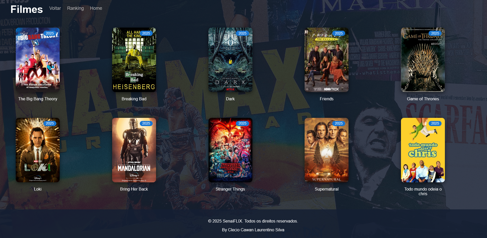
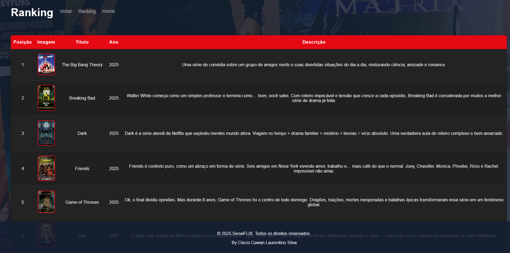

# SenaiFlix-indexadorDeSeries

## 💻 Sobre o Projeto

> 🚀 O **Senai Flix** é um projeto que funciona como um indexador de séries: permite organizar, buscar e explorar séries de TV — ideal para estudo/prática de Front-end . O objetivo é criar uma aplicação simples, responsiva e extensível que reúne informações de séries, gera filtros, listas pessoais (watchlist).

Este projeto realizado dia 10/02/2025 não possui fins comerciais e foi criado apenas **para fins educacionais**.

---

## 📸 Demonstração

  

  

  

[SenaiFlix-indexadorDeSeries](https://senai-page.vercel.app/)

---

## 🚀 Tecnologias

As seguintes ferramentas e tecnologias foram utilizadas na construção do projeto:

#### **Frontend**
- HTML
- CSS

---

## 📝 Licença

Este projeto está sob a licença MIT. Veja o arquivo [LICENSE](LICENSE) para mais detalhes.

---

## 👨‍💻 Autor

Feito por **Clecio Cawan Laurentino Silva**.

